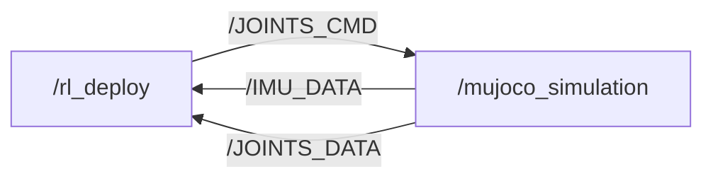

# M20 SDK Deploy

[](https://discord.gg/gdM9mQutC8)
## Overview
This repository uses ROS2 to implement the entire Sim-to-sim and Sim-to-real workflow. Therefore, ROS2 must first be installed on your computer, such as installing [ROS2 Humble](https://docs.ros.org/en/humble/index.html) on Ubuntu 22.04. We've also released an introduction [video](https://www.youtube.com/watch?v=FNaxsDBtD7A), please check it out! Please go through the whole process on a Ubuntu system.

```bash
# ros2 topic list
/BATTERY_DATA
/IMU_DATA
/JOINTS_CMD
/JOINTS_DATA
/parameter_events
/rosout


# ros2 node info /mujoco_simulation 
/mujoco_simulation
  Subscribers:
    /JOINTS_CMD: drdds/msg/JointsDataCmd
  Publishers:
    /IMU_DATA: drdds/msg/ImuData
    /JOINTS_DATA: drdds/msg/JointsData
    /parameter_events: rcl_interfaces/msg/ParameterEvent
    /rosout: rcl_interfaces/msg/Log
  Service Servers:
    /mujoco_simulation/describe_parameters: rcl_interfaces/srv/DescribeParameters
    /mujoco_simulation/get_parameter_types: rcl_interfaces/srv/GetParameterTypes
    /mujoco_simulation/get_parameters: rcl_interfaces/srv/GetParameters
    /mujoco_simulation/list_parameters: rcl_interfaces/srv/ListParameters
    /mujoco_simulation/set_parameters: rcl_interfaces/srv/SetParameters
    /mujoco_simulation/set_parameters_atomically: rcl_interfaces/srv/SetParametersAtomically
  Service Clients:

  Action Servers:

  Action Clients:


# ros2 node info /rl_deploy 
/rl_deploy
  Subscribers:
    /BATTERY_DATA: drdds/msg/BatteryData
    /IMU_DATA: drdds/msg/ImuData
    /JOINTS_DATA: drdds/msg/JointsData
    /parameter_events: rcl_interfaces/msg/ParameterEvent
  Publishers:
    /JOINTS_CMD: drdds/msg/JointsDataCmd
    /parameter_events: rcl_interfaces/msg/ParameterEvent
    /rosout: rcl_interfaces/msg/Log
  Service Servers:
    /rl_deploy/describe_parameters: rcl_interfaces/srv/DescribeParameters
    /rl_deploy/get_parameter_types: rcl_interfaces/srv/GetParameterTypes
    /rl_deploy/get_parameters: rcl_interfaces/srv/GetParameters
    /rl_deploy/list_parameters: rcl_interfaces/srv/ListParameters
    /rl_deploy/set_parameters: rcl_interfaces/srv/SetParameters
    /rl_deploy/set_parameters_atomically: rcl_interfaces/srv/SetParametersAtomically
  Service Clients:

  Action Servers:

  Action Clients:

```
## Contribution 

Everyone is welcome to contribute to this repo. If you discover a bug or optimize our training config, just submit a pull request and we will look into it.
## Sim-to-sim

```bash
pip install "numpy < 2.0" mujoco
git clone https://github.com/DeepRoboticsLab/sdk_deploy.git

# Compile
cd sdk_deploy
source /opt/ros/<ros-distro>/setup.bash
colcon build --packages-up-to m20_sdk_deploy --cmake-args -DBUILD_PLATFORM=x86
```

```bash
# Run (Open 2 terminals)
# Terminal 1
export ROS_DOMAIN_ID=1
source install/setup.bash
ros2 run m20_sdk_deploy rl_deploy

# Terminal 2 
export ROS_DOMAIN_ID=1
source install/setup.bash
python3 src/M20_sdk_deploy/interface/robot/simulation/mujoco_simulation_ros2.py
```

### Control (Terminal 2)

<span style="color: red;">**Note:**</span>
> - Right click simulator window and select "always on top"
> - When the robot dog stands up, it may become stuck due to self-collision in the simulation. This is not a bug; please try again.
> - z： default position
> - c： rl control default position
> - wasd：forward/leftward/backward/rightward
> - qe：clockwise/counter clockwise


# Sim-to-Real
This process is almost identical to simulation-simulation. You only need to add the step of connecting to Wi-Fi to transfer data, and then modify the compilation instructions.Real-robot control is divided into keyboard mode and gamepad control mode. You need to modify the RemoteCommandType parameter in the main function to select the desired mode.


**Please first use the OTA upgrade function in the handle settings to upgrade the hardware to version 1.1.8. We require a sdk authentication code to activate the sdk mode. Please contact our technical support team to get this unique code for each robot.**


```bash

# computer and gamepad should both connect to WiFi
# WiFi: M20********
# Passward: 12345678 (If wrong, contact technical support)

# scp to transfer files to quadruped (open a terminal on your local computer) password is ' (a single quote)
scp -r ~/sdk_deploy/src user@10.21.31.103:~/sdk_deploy

# ssh connect for remote development, 
ssh user@10.21.31.103
cd sdk_deploy
source /opt/ros/foxy/setup.bash #source ROS2 env
colcon build --packages-select m20_sdk_deploy --cmake-args -DBUILD_PLATFORM=arm


sudo su # Root
source /opt/ros/foxy/setup.bash #source ROS2 env
source /opt/robot/scripts/setup_ros2.sh
ros2 service call /SDK_MODE drdds/srv/StdSrvInt32 command:\ 200 # /200 is /JOINTS_DATA topic frequency, recommended below 500 Hz. This value can only be factors of 1000.

# Run
source install/setup.bash
ros2 run m20_sdk_deploy rl_deploy

# exit sdk mode：
ros2 service call /SDK_MODE drdds/srv/StdSrvInt32 command:\ 0
```

### ⌨️ Keyboard Control
*(Note: When the robot dog stands up, it may become stuck due to self-collision in the simulation. This is not a bug; please try again.)*
- z： default position
- c： rl control default position
- x： lie down
- wasd：forward/leftward/backward/rightward
- qe：clockwise/counter clockwise

### 🎮 Gamepad Control
*(Note: When using the gamepad control function, please ensure that the Gamepad APP version is V1.5.11 or higher.)*
- L1： default position
- L2： rl control default position
- R1： lie down
- R2： joint damping
- Left joystick：forward/leftward/backward/rightward
- Right joystick：clockwise/counter clockwise

